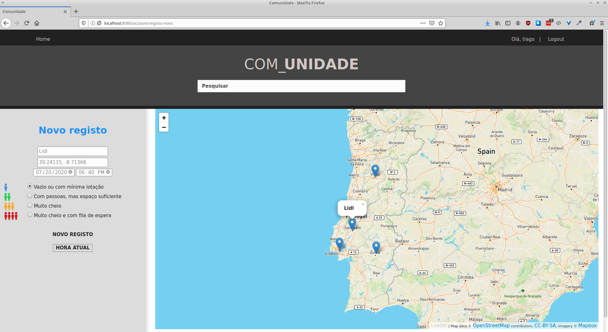

## Fullstack Website
The task consists of a **website** where users can share a store's capacity.

This project was done using [**Spring Boot**](https://spring.io/projects/spring-boot) and makes use of components as [**Spring Security**](https://spring.io/projects/spring-security) and [**Spring JPA**](https://spring.io/projects/spring-data-jpa) .
To better visualize the data [*Leafletjs*](https://leafletjs.com/), a *javascript* library was also used to show the place of the store on a map.

